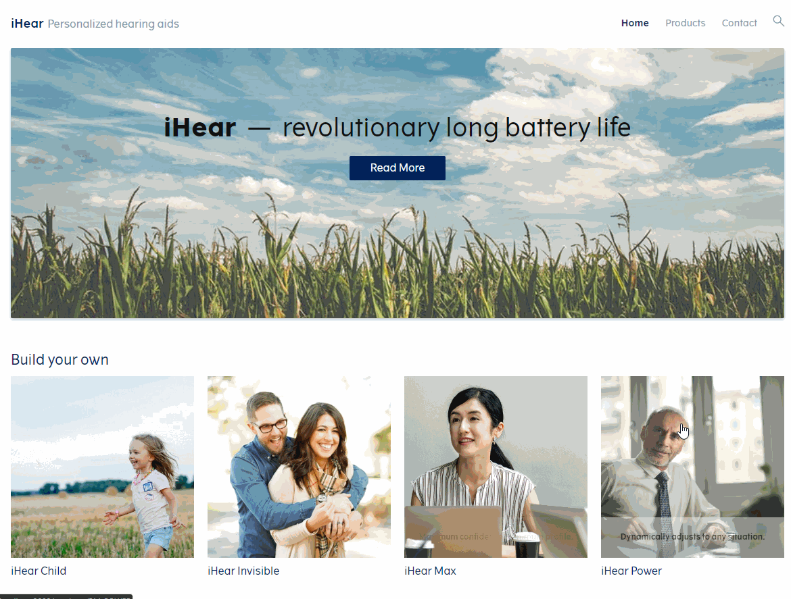

# iHear sample application

The iHear sample illustrates how to build a webshop-style configurator with the iHear model hosted on Ace Platform.



## Getting started

Before running the application for the first time, change the settings in the
`.env` file to match your Ace Platform installation:

- `REACT_APP_API_URL` — Replace `localhost:9000` with your Ace Platform host
  and port.
- `REACT_APP_PACKAGE_PATH` — Reference the published package you want to use.
  The demo requires the package has a configurable product with the ID `IHEAR`.
- `REACT_APP_API_KEY` — Add your API key if necessary. See 
  [Authentication](../README.md#authentication) for details.

Next, install the code dependencies:

```
npm install
```

Then start the application:

```
npm start
```

## Making it your own

This sample is made specifically for the iHear product. To change it to work
with one of your products, see [Customizing the iHear sample application](docs/README.md).
