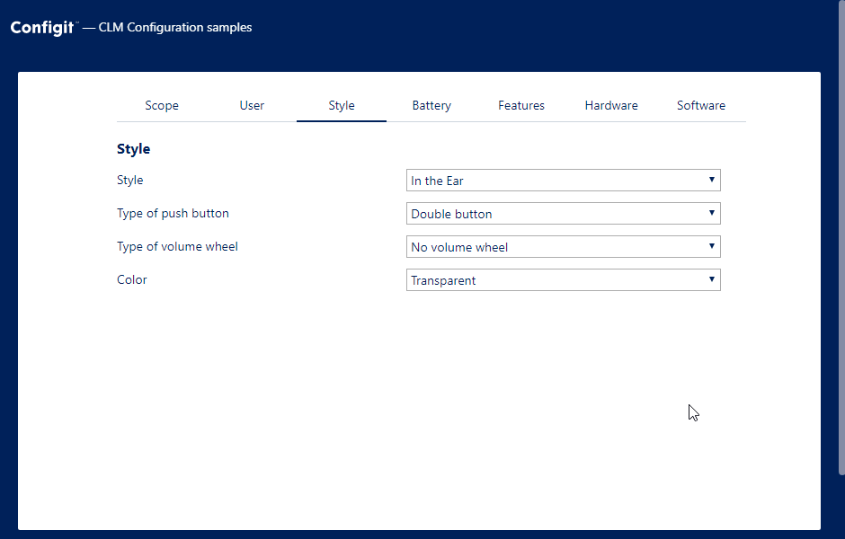

## Products API Sample

The products search example shows how to create a small application that allows users to configure a product in a package on the CLM Platform.

The application we are building looks like this:



The code for the product search example is located at `src/examples/configurator/index.js`.

The root component looks like this:

```jsx
import configure from '../../api/configure';

class Configurator extends React.Component {
  assignments = [];

  state = {
    activeTabIndex: 0
  };

  async componentDidMount() {
    this.configure();
  }

  render() {
    const { productId } = this.props.match.params;
    if (!productId) {
      return (
        <Example>
          <div>
            <p>To start the configurator specify a product id in the URL. </p>
            <p>
              For examples{' '}
              <a href="/configurator/IHEAR">/configurator/IHEAR</a>
            </p>
          </div>
        </Example>
      );
    }

    const { sections, activeTabIndex, error } = this.state;
    if (error) {
      return <Example>{error}</Example>;
    }

    if (!sections) {
      return <Example>Loading…</Example>;
    }
    const activeSection = sections[activeTabIndex];
    return (
      <Example>
        <div className="configurator">
          <Tabs
            tabs={sections.map(section => section.name)}
            onTabChange={this.handleActiveTabChange}
            activeTabIndex={activeTabIndex}
          >
            {activeSection.sections.map(subsection => (
              <Section
                section={subsection}
                key={subsection.id}
                onAssign={this.handleOnAssign}
              />
            ))}
            <Section
              section={{ variables: activeSection.variables }}
              onAssign={this.handleOnAssign}
              onUnassign={this.handleOnUnassign}
            />
          </Tabs>
        </div>
      </Example>
    );
  }
}
```

Here, the `configure` function calls the API and updates the local state with the returned data:

```jsx
  configure = async assignments => {
    const { productId } = this.props.match.params;
    const packagePath = process.env.REACT_APP_PACKAGE_PATH;

    try {
      const result = await configure({
        packagePath,
        date: new Date(),
        line: {
          productId,
          variableAssignments: assignments
        }
      });

      this.setState({ sections: result.sections, error: null });
    } catch (e) {
      if (e.type === 'CannotLoadPackage') {
        this.setState({
          error: `Product with id '${productId} doesn't exist in package with path '${packagePath}'`
        });
      }
    }
  };
```

In addition to this, we define three functions to handle the interaction when the user changes tab, assigns a value to a variable, and removes an assignment:

```jsx
  handleActiveTabChange = activeTabIndex => this.setState({ activeTabIndex });

  handleOnAssign = (variableId, value, exclude, multivalued) => {
    const newAssignments = assign(
      this.assignments,
      { variableId, value, exclude },
      multivalued
    );
    this.assignments = newAssignments;
    this.configure(newAssignments);
  };

  handleOnUnassign = (variableId, value, exclude) => {
    const newAssignments = unassign(this.assignments, {
      variableId,
      value,
      exclude
    });
    this.assignments = newAssignments;
    this.configure(newAssignments);
  };
```

